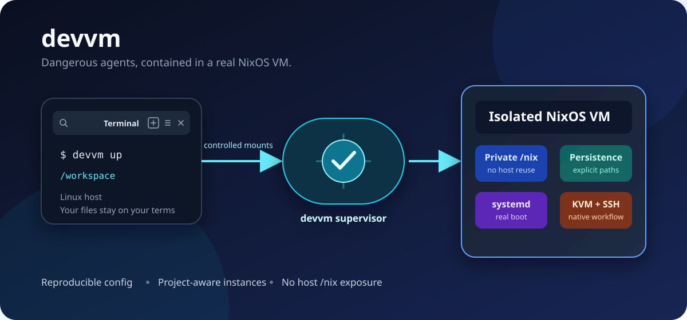
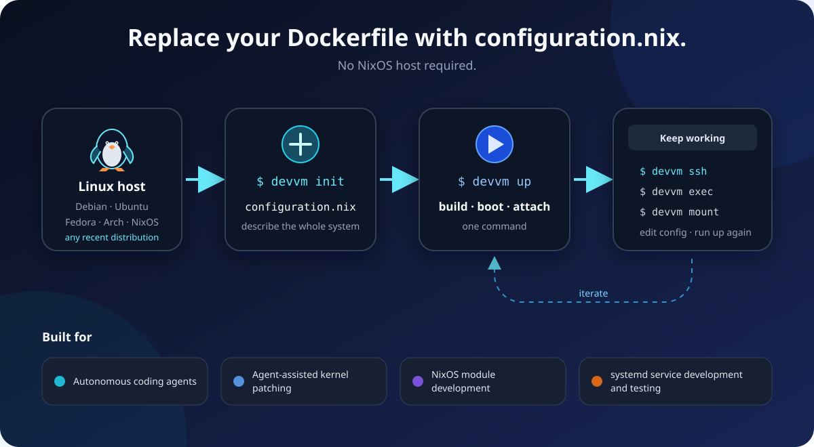

# DevVM: a secure, efficient, reproducible NixOS Linux VM for self-improving agentic workflows

In 2026, agentic loops are becoming increasingly unattended as LLM-based coding harnesses improve. However, the use of such harnesses and external LLM providers still raises security and privacy concerns.

Existing tools attempt to confine a session, but bubblewrap-based containers often map the current host user to root inside the container. If the workload escapes, it can quietly read the host user's `.ssh` credentials or API secrets as that user. In addition, when we want an agent to configure a Linux system directly, we may need to expose `CAP_SYS_ADMIN` (for rootless containers with `systemd`) and/or `/dev/kvm` (for QEMU/KVM), which exposes additional attack surface.

Running coding agents in *dangerous mode* - with full access to the local machine and the internet - is desirable for productivity. However, it can expose network fingerprints such as the hostname, usernames, MAC address, and network topology, and it can allow read/write access to files outside the session workspace through supply-chain attacks. A simpler approach, such as a NixOS container that reuses the host `/nix`, still makes it easy for a workload to identify vulnerable or profitable targets on the host.

## About

This repo boots a NixOS-based system sandbox on a local Linux host.

It gives you a real booted NixOS userland with `systemd`, persistence, and SSH access.

This is a good fit for packaging, service work, NixOS modules, and NixOS learning in general. You can iterate on a real [`configuration.nix`](template/configuration.nix), rebuild, and observe how services, users, SSH, packages, and persistent state behave together without sacrificing security and privacy.

This is not yet a polished runtime. It remains an experimental launcher under heavy development.

The target host platform is recent `amd64` Linux in general, not just NixOS. If this does not run on a reasonably current Linux machine, that should be treated as a bug rather than an unsupported edge case.

The `devvm` command handles instance bootstrap, guest builds, libvirt startup, attach, and mounts.

## Installation

- Nix Flakes: `nix run github:<OWNER>/<REPO>`
- Debian/Ubuntu, Fedora/RHEL, Arch: install packages from [GitHub Releases](https://github.com/<OWNER>/<REPO>/releases)
  - `.deb` / `.rpm` / `.pkg.tar.zst`

## Using

Linux host (x86_64/amd64) with KVM, libvirt session QEMU, passt, and virtiofsd is required.

- `devvm`
  If the VM is running, attach to it; otherwise, rebuild and start it.
- `devvm <command>`
  Run a command against the selected project and hostname.

The subcommands are similar to those of **Docker Compose**.
```
Usage: devvm [OPTIONS] [COMMAND]

Commands:
  version         Show version
  doctor          Show diagnostics
  init            Create `.devvm/` and write the initial template files
  build           Build the guest system
  up              Rebuild and start a VM; if already running, build and switch
  down            Tear down the VM gracefully
  kill            Forcibly stop the VM
  pause           Pause running VMs for all hostnames in the current config
  unpause         Unpause VMs for all hostnames in the current config
  destroy         Kill and delete guest files selected by flags (none by default)
  ls              List all VMs stored
  ps              List VM statuses for all hostnames in the current config
  ssh             Run a command as a user in a running VM, or attach if omitted
  exec            Run a command as root in a running VM, or attach if omitted
  logs            Show logs from a running VM. Runs `journalctl` with `-en1000` by default
  stats           Display statistics of CPU time, memory for VMs
  wait            Block until this VM becomes one of the states. Wait for stop states by default
  mount           Mount a file or directory into a running VM, or show mounts entries
  unmount         Unmount a file or directory from a running VM now and on future starts
  port            Prints the public port for a port binding
  allow-domain    Add a domain to the hostname-specific TOML policy
  unallow-domain  Remove a domain from the hostname-specific TOML policy
  proxy-logs      Follow MITM proxy logs
  verify          Verify and repair build
  audit           Run CVE scan against the guest store
  help            Print this message or the help of the given subcommand(s)

Options:
  -g, --global                       Use only global config (`$XDG_CONFIG_HOME/devvm`) and skip local upward search
  -p, --project-name <PROJECT_NAME>  Select project name. Combined with hostname to form the instance name
  -n, --hostname <HOSTNAME>          Select sandbox hostname (build target and instance identity input) [default: default]
  -w, --workspace <WORKSPACE>        Resolve the active workspace and config as if running from this directory
  -h, --help                         Print help
  -V, --version                      Print version
```

## Quick Start

```bash
# 1) Initialize local config in current workspace
devvm init
# 2) Build and start VM (attaches if startup succeeds)
devvm up
# 3) Open guest shell (user)
devvm ssh
# 4) Run command as root in guest
devvm exec -- uname -a
# 5) Stop VM gracefully
devvm down
```
For global (project-less) usage, initialize once with:
```bash
devvm --global init
```

## Configuration

`init` writes `.devvm/devvm.toml`. An optional
`.devvm/devvm.local.toml` overrides it. Within each file, base
values are merged with `[hosts.<hostname>]` values. CLI `mount`,
`unmount`, `allow-domain`, and `unallow-domain` edits are kept in the local
file.

Relative paths passed to `mount` and `unmount` are resolved from the shell's
current directory, then stored relative to `--workspace`. Use `--read-only`
with `mount` for a read-only guest mount. `build` and `up` preserve `flake.lock`
by default; pass `--write-lock` to allow an update.

Set `vm.useHostCerts = true` to mount the detected host CA bundle over the guest's default CA bundle on its next start.

The domain policy is stored in TOML but is not enforced in v0.3. MITM proxy,
allowlist enforcement, and proxy logs remain unimplemented.

## Development

Run development commands through `nix develop`, for example
`nix develop -c cargo run -- <subcommand> <options>`.
Use `doctor` subcommand to verify host setup.

## License

MIT
